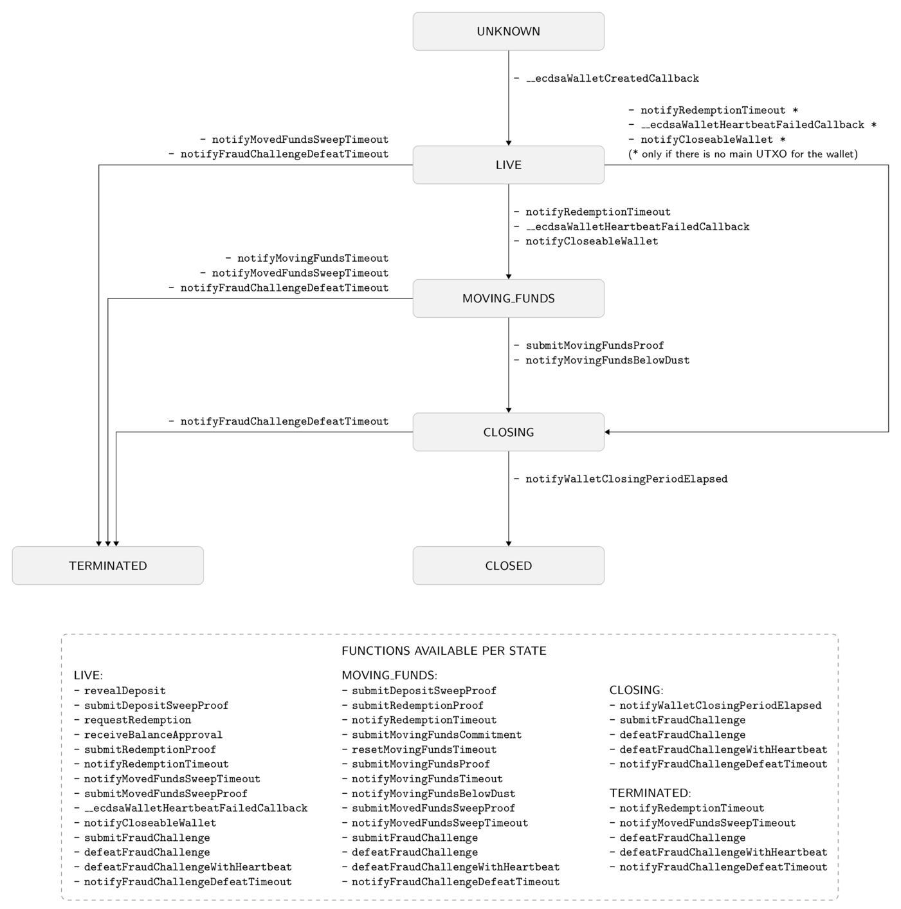

= TBTC v2

== Abstract

For many Bitcoin holders, one question remains: how can I move my assets across
blockchains to make them more useful while maintaining Bitcoin's core values?

Existing solutions that bridge Bitcoin to Ethereum require users to send their
Bitcoin to an intermediary in exchange for an Ethereum token that represents the
original asset. This centralized model requires you to trust a third party and
is prone to censorship, threatening Bitcoin's promise of secure, permissionless
decentralization.

Threshold aims to solve this problem with TBTC v2.

The second generation of TBTC is a truly decentralized bridge between Bitcoin
and Ethereum. It provides Bitcoin holders permissionless access to DeFi and the
expanding web3 universe.

TBTC v2 replaces centralized intermediaries with a randomly selected group of
node operators on the Threshold Network. This group of independent operators
works together to secure your deposited Bitcoin through threshold cryptography.
That means TBTC v2 requires a majority threshold agreement before operators
perform any action with your Bitcoin. By rotating the selection of operators,
TBTC v2 protects against any malicious individual or group of operators seizing
control. Unlike other solutions on the market, users on TBTC v2 are reliant on
math, not hardware or people. Additionally, TBTC v2 is open and accessible to
anyone.
  
TBTC v2 allows anyone to use Bitcoin in the expanding DeFi and Web3 universe
without a third-party intermediary. 

== System Architecture

=== Wallet States

There are six states for a wallet:

- `UNKNOWN`: The wallet is unknown to the Bridge.
- `LIVE`: The wallet can sweep deposits and accept redemption requests.
- `MOVING_FUNDS`: The wallet was deemed unhealthy and is expected to move its
  outstanding funds to another wallet. The wallet can still fulfill its
  pending redemption requests although new redemption requests and new deposit
  reveals are not accepted.
- `CLOSING`: The wallet moved or redeemed all its funds and is in the closing
  period where it is still a subject of fraud challenges and must defend against
  them. This state is needed to protect against deposit frauds on deposits
  revealed but not swept.
- `CLOSED`: The wallet finalized the closing period successfully and can no
  longer perform any action in the Bridge.
- `TERMINATED`: The wallet committed a fraud that was reported, did not move
  funds to another wallet before a timeout, or did not sweep funds moved to it
  from another wallet before a timeout. The wallet is blocked and can not
  perform any actions in the Bridge. Off-chain coordination with the wallet
  operators is needed to recover funds.





=== Upgradeability

`Bank` is a central, non-upgradeable contract keeping track of Bitcoin balances. 

`Bridge` is deployed behind a `TransparentUpgradeableProxy` and can be upgraded
by a `ProxyAdmin`, eventually Threshold DAO.

`TBTCVault` upgrade happens in two steps with a 24-hour governance delay. The
owner of `TBTCVault` can initiate and finalize an upgrade to another vault.
The new vault receives ownership of TBTC token as well as the entire `TBTCVault`
balance in the Bank.

=== Bridge, Bank, Vault Separation

The system is decomposed into three separate pieces to separate concerns. The
<<bridge,Bridge>> is concerned with being a decentralized Bitcoin custody, and
providing a way to let the <<bank,Bank>> know whenever Bitcoin has successfully
crossed from Bitcoin to another chain or visa versa.

The <<bank,Bank>> is concerned with keeping track of Bitcoin account balances on
Ethereum. It tracks when folks send those balances to each other, and when
folks lock up their balances in <<vault,Vaults>>.

Vaults are authorized smart contracts that can custody a balance and then do
_anything_. For example, TBTC (the token) is implemented as our flagship Vault.
You let it custody your Bank balance and it gives you TBTC tokens. You give it
back TBTC tokens and it gives you back your Bank balance.

[bridge]
==== Bridge

The Bridge is our interface to the Bitcoin blockchain and the off-chain
clients. It is the Bridge's responsibility to listen to <<depositing,deposit
reveals>>, <<sweeping,sweep>> them, prove it did it, and then report any relevant
information to the <<bank,Bank>>.

When it comes time to redeem, it is the Bridge's responsibility to listen to
<<redeeming,redemption requests>>, disperse the funds, prove it did it, and then
report any relevant information to the <<bank,Bank>>.

Finally, everything about Bitcoin <<wallet-lifecycle,wallets>> falls in the
purview of the Bridge.

[bank]
==== Bank

The Bank provides Bitcoin balance accounting for Ethereum addresses with two mappings:

```
mapping(address => uint256) public balanceOf;
mapping(address => mapping(address => uint256)) public allowance;
```

Notably, the Bank does not issue an ERC-20 token, it just does accounting. The
`balanceOf` mapping keeps track of an Ethereum address's Bitcoin balance (in
satoshis). Meanwhile, the `allowance` mapping keeps track of how many satoshis
a _spender_ may transfer on an Ethereum address's behalf. Each Ethereum address
may have many spenders, each with different allowances.

A notable use of an `allowance` is to authorize a <<vault,Vault>> to custody your
funds, but allowances are more general.

[vault]
==== Vault

A Vault is an authorized Contract that interfaces with the <<bank,Bank>>. These
are flexible, and allow us (and third parties) to write logic on top of the
Bank architecture to implement financial systems built from Bitcoin balances.

For example, TBTC is implemented as a Vault. A user with a Bank balance gives
the `TBTCVault` an `allowance`, and then it uses that allowance to transfer
itself Bank Balance to hold on behalf of the user, in exchange for minting the
user the equivalent amount of TBTC tokens. Later, anyone with TBTC tokens can
send them back to the `TBTCVault` and the vault will grant them Bank balance.

== The Mechanism

[wallet-lifecycle]
=== Wallet Lifecycle

==== Wallet Creation

We kick off the wallet creation mechanism in
link:https://github.com/keep-network/keep-core/tree/main/solidity/ecdsa[keep-core/ecdsa]
via `Bridge.requestNewWallet`, which verifies:

* That we're not currently already creating a wallet
* If we have an active wallet it either:
** Is old enough and has over `walletCreationMinBtcBalance` 
** Has over `walletCreationMaxBtcBalance`

If everything looks good, we kick off the wallet creation mechanism outlined in 
link:https://github.com/keep-network/keep-core/tree/main/solidity/ecdsa#the-mechanism[Wallet
Creation] (through keep-core/ecdsa). This leans heavily on the 
link:https://github.com/keep-network/keep-core/tree/main/solidity/random-beacon#the-mechanism[Random
Beacon].

Once that is finished, the wallet registry can call
`Bridge.__ecdsaWalletCreatedCallback`, which sets the new wallet as the active
wallet. Going forward, it will receive deposits.

==== Wallet Closure

Wallets can close in a few ways:

* The operators notify the chain that the wallet is failing a heartbeat:
`Bridge. __ecdsaWalletHeartbeatFailedCallback` (called by `ecdsa`
`WalletRegistry.notifyOperatorInactivity`)`
* Someone notifies the chain that the wallet timed out while filling a
redemption: `Bridge.notifyRedemptionTimeout`
* Someone notifies the chain that a non-active wallet is too old:
`Bridge.notifyWalletCloseable`
* Someone notifies the chain that a non-active wallet has too few BTC
remaining: `Bridge.notifyWalletCloseable`

Each of the above routes into `Wallets.moveFunds`. If the wallet has no main
UTXO, then we can start closing it immediately via
`Wallets.beginWalletClosing`. Otherwise, we change it's state to
`WalletState.MovingFunds`, decrease the live wallet count, and give the wallet
a deadline to move its funds to other wallet(s). If this was the active wallet,
then we currently have no active wallet.

After `movingFundsTimeout` goes by, anyone can call
`Bridge.notifyMovingFundsTimeout` which pipes into
`Wallets.terminateWallet` followed by `ecdsaWalletRegistry.seize`.
`terminateWallet`, in this case passes through to
`ecdsaWalletRegistry.closeWallet` after changing the state to
`WalletState.Terminated`.

Furthermore, the `ecdsaWalletRegistry.seize` call is punishing the operators by
`movedFundsSweepTimeoutSlashingAmount` and rewarding the notifier with a reward
multiplier of `movedFundsSweepTimeoutNotifierRewardMultiplier` (the notifier
gets a percentaged of the slashed stake).

In order to avoid this, the wallet has to commit to which wallets they'll send
the funds to (`Bridge.submitMovingFundsCommitment`), then actually send
the funds to those wallets, and then prove that they did it
(`Bridge.submitMovingFundsProof`) before the time runs out.

The commitment involves submitting a list of wallet public keys that:

* Aren't the source wallet 
* Are in ascending order
* Are Live

We store the hash of the list in `movingFundsTargetWalletsCommitmentHash`.
Off-chain we come to consensus by picking the Live wallets whose public key
hashes are the closest to the source wallet's public key hash in terms of clock
distance (modulus distance). This makes public key hashes in the middle of the
range no more likely to be picked than ones near the ends. We pick a number of
wallets equal to `min(liveWalletsCount, ceil(walletBtcBalance /
walletMaxBtcTransfer))`, where `walletMaxBtcTransfer` is governable.

In `submitMovingFundsProof`, we prove that the Bitcoin transaction happened and
has an appropriate number of confirmations, and then mark the source wallet's
UTXO as spent via `OutboundTx.processWalletOutboundTxInput`. We pass the
transaction's outputs into `MovingFunds.processMovingFundsTxOutputs`, sum up
the funds and return a hash of the target wallets to check against
`movingFundsTargetWalletsCommitmentHash` in `notifyWalletFundsMoved`.

If the hashes match, we begin closing the wallet via `beginWalletClosing`.
After `walletClosingPeriod` has elapsed, anyone can call
`Bridge.notifyWalletClosingPeriodElapsed` to close the wallet.

=== Transferring Bitcoin

[depositing]
==== Depositing

When the system has an active wallet (denoted by
`Bridge.activeWalletPubKeyHash()`), it is ready for deposits. A user can pay to
a P2(W)SH address with the following Bitcoin script:

```
<depositor> DROP
<blindingFactor> DROP
DUP HASH160 <walletPubKeyHash> EQUAL
IF
  CHECKSIG
ELSE
  DUP HASH160 <refundPubkeyHash> EQUALVERIFY
  <refundLocktime> CHECKLOCKTIMEVERIFY DROP
  CHECKSIG
ENDIF
```

Since each depositor will have their ethereum address (the `depositor` field),
and a different `blindingFactor` per deposit, each script will be unique and
each script hash will be unique. The `<depositor> DROP <blindingFactor> DROP`
header is a way to make the script commit to a particular eth address owner at
Bitcoin deposit time, and it's what allows us to link the chains. `DUP HASH160
<walletPubKeyHash> EQUALVERIFY CHECKSIG` is a standard P2PKH, so we slightly
modify that to check to see if the signature matches rather than failing. If it
doesn't match, we want to check a _different_ pkh: `refundPubkeyHash`. This is
a user-provided refund address, and it's only available after `refundLocktime`.
The idea is that they can send funds to this script hash, and if the system is
broken or if something goes wrong, then after `refundLocktime` (30 days), they
can send their funds back to `refundPubkeyHash` themselves. This would only
work if the wallet hadn't <<sweeping,touched>> those funds yet.

Once a Bitcoin user sends such a deposit, because their P2(W)SH address is
unique to them, _only they_ know that they deposited into TBTCv2 until they
reveal that they did so. To the rest of the Bitcoin world, this looks like a
nondescript payment to a meaningless P2SH address. They make this reveal (which
can be done immediately; no need to wait for confirmations) by calling
`Bridge.revealDeposit`.

`Bridge.revealDeposit` takes in the funding transaction, and then the necessary
information to reconstruct the Bitcoin script: `depositor`, `blindingFactor`,
`walletPubKeyHash` and `refundPubkeyHash`. Then it reconstructs the script,
hashes it, verifies that the hashes match, and then stores the deposit as
waiting to be <<sweeping,swept>> associated to the provided `depositor`.

[sweeping]
==== Sweeping

Periodically, off-chain clients associated to a wallet collect a batch of
deposits and create a sweep transaction. This transaction includes revealed and
valid deposit UTXOs as well as the wallet's UTXO (`Wallet.mainUtxoHash`) as
inputs and then creates a single UTXO output. This accomplishes two main
purposes:

* It amortizes fees (SPV proof fee and Bitcoin tx fee, etc) across all of the deposits.
* It disables the refund mechanism from the original script.

The first is a cost vs time tradeoff. SPV proofs are expensive, so by dividing
the cost across all of the deposits in the period, we see massive gas savings.
This is the same model as individuals driving their own car to work vs waiting
on the train. The second is a security measure. We need to disable the refund,
otherwise users could get a Bank balance and then refund their Bitcoin and have
both.

The entry point is `Bridge.submitDepositSweepProof` which performs the SPV
proof, updates the wallet with the new UTXO (from
`DepositSweep.resolveDepositSweepingWallet`), takes a deposit fee for the
treasury (5 BPS; governable), and updates the user Bank balances with information
from `DepositSweep.processDepositSweepTxInputs` and
`DepositSweep.depositSweepTxFeeDistribution`.

[redeeming]
==== Redeeming

An account with a Bank balance can request a redemption via
`Bridge.requestRedemption`. We verify that the destination is valid (P2PKH,
P2WPKH, P2SH or P2WSH), and build a redemption key based on the wallet's PKH
and destination. There can only be one pending redemption per PKH-destination
pair. The treasury takes a cut (`Bridge.redemptionTreasuryFeeDivisor`), and
then we reduce the account's Bank balance and start a timer.

[TIP]
`Bridge.requestRedemption` requires a Bank balance approval to the Bridge. This
can either be made in a separate transaction first via
`Bank.approveBalance(Bridge.address, ...)` or in a single transaction via
`Bank.approveBalanceAndCall(Bridge.address, ...)`.

If the redemption was not performed by the wallet, after the redemption
timeout, anyone may call `Bridge.notifyRedemptionTimeout`. This will decrease
`wallet.pendingRedemptionsValue`, mark the redemption as "timed out", punish
the operators for `Bridge.redemptionTimeoutSlashingAmount`, and reward the
notifier for a percentage (`Bridge.redemptionTimeoutNotifierRewardMultiplier`)
of the slashed stake. The redeemer is reimbursed the Bank balance of the
redemption, and the wallet begins to move its funds via
`Wallets.notifyWalletTimedOutRedemption`.

To avoid this, the operators must fulfill the redemption by signing a
transaction off-chain (potentially in a batch), submitting it to the Bitcoin
chain, and then proving that they did so via `Bridge.submitRedemptionProof`. We
perform an SPV proof to ensure the transaction occurred, it is well-formed, and
then we decrease all of the redeemer's Bank balances and increase the treasury's
Bank balance with its cut. 

=== Tokenizing

==== Minting

Up until this point, no TBTC has been created. We have dealt strictly with Bank
balances. Anyone with a Bank balance can transfer that Bank balance to the
TBTCVault to mint the equivalent amount of TBTC via `TBTCVault.mint`.

A <<depositing,depositor>> can specify in their reveal call
(`Bridge.revealDeposit`) a `vault`. If they do, rather than getting a balance
and having to come back later to submit additional transactions, the system
automatically commits any funds to the requested vault, and propagates any
results. In the case of the `TBTCVault`, this means that one can specify during
their deposit reveal that they wish for their balance to be put toward the
`TBTCVault`, and as soon as everything goes through they will automatically be
minted TBTC tokens.

During <<sweeping,sweeping>>, we look for `vault` information in the call data,
and if we find it, we make a call to `Bank.increaseBalanceAndCall` rather than
`Bank.increaseBalances` which routes to `vault.receiveBalanceIncrease`, which
in turn calls `TBTC._mint`, in TBTC's case.

==== Unminting

Anyone with TBTC tokens can unmint them in exchange for Bank balance by calling
`TBTCVault.unmint`. Alternatively, if the user is attempting to exit the system
entirely, they can save a transaction and gas by calling
`TBTCVault.unmintAndRedeem` which routes into authorizing the Bridge to
<<redeeming,redeem>> via `bank.approveBalanceAndCall`.

=== Maintainers

`Bridge` has a set of public knowledge functions that need to be called from
time to time. A public-knowledge function is where anyone has access to the
information required to assemble the transaction and the transaction does not
lead to punishment (slashing).

To compensate for calling these transactions, the caller has the gas spent
reimbursed by a DAO-funded ETH pool in the same transaction. This works only if
callers follow the order and do not try to front-run each other. Given that the
reimbursement code is constructed in such a way that the caller is net-zero or
minimally positive after the refund, there should be no reason for callers to
front-run each other. On the other hand, a single malicious front-runner can
break this scheme. If there is someone who does not follow the order and keeps
submitting transactions - for which they are reimbursed - everyone else will
stop doing that because they will only burn gas on reverted transactions.

One approach to address this problem could be to enforce the submission order
on-chain. Although it sounds easy at first, it is complicated and expensive in
practice. The code needs to take into account scenarios when someone is
temporarily offline and missed their submission round or when someone is
permanently offline and keeps missing their round all the time which causes
delays and slows down the network. Attempts to address these problems by marking
someone as ineligible for rewards in case they missed their round are making the
on-chain submission order enforcement mechanism only more expensive.

Another approach is to not enforce the order on-chain, have everyone with at
least the minimum stake be able to submit public-knowledge transactions, and
expect that everyone respects the informal agreement about the submission order.
This approach works fine as long as there is no single malicious player with the
minimum stake to break this scheme. To address this problem, we could introduce
a mechanism for slashing submitters not respecting the order but it is again,
complex in practice, and makes us reimplement solutions like Gelato Network.

We approach this problem in the easiest way possible by reducing a problem to
a smaller group and introducing a list of submitters who are getting reimbursed
for their calls. We call them maintainers. Maintainers are third-party bots who
are expected to follow an off-chain informal agreement about the submission
order and do not front-run each other. If they do, they can get deauthorized for
reimbursements by the DAO. Maintainers are no more trusted than any other
address on Ethereum. Anyone can submit public-knowledge `Bridge` transactions
but they will not get reimbursed for doing so. To not mix the concept of
reimbursement with the logic of the `Bridge` contract, we placed the
reimbursement logic in a special contract called `MaintainerProxy`. Only
DAO-authorized maintainers can call `Bridge` via `MaintainerProxy` and get
reimbursed for the call but it does not block anyone from calling `Bridge`
directly. The only difference is that those calling `Bridge` directly will not
get reimbursed. This should be enough to prevent malicious actors from
front-running honest maintainers.

`Bridge.submitDepositSweepProof` and `Bridge.submitRedemptionProof` are
functions that must be called often and they execute quite an expensive SPV
proof. These functions need to be protected with `onlyMaintainer` notifier in
`MaintainerProxy`.

`Bridge.submitMovingFundsProof` and `Bridge.submitMovedFundsSweepProof` are
functions that are called less often but they also execute an expensive SPV
proof. The input parameters to them are pretty much the same as for
`Bridge.submitDepositSweepProof` and `Bridge.submitRedemptionProof` so we assume
calling them is also the maintainer's responsibility and we protect them in
`MaintainerProxy` with `onlyMaintainer` modifier.

It is important to note that the off-chain client software should not rely
entirely on maintainers to call these functions. If proofs are not submitted on
time, the wallet can be accused of fraud, or it can get slashed because of
exceeding redemption timeout, moving funds timeout, or sweeping moved funds
timeout. The wallet should expect the maintainer bots to do their work but it
should also monitor if that actually happens. If not, the wallet should submit
the proof itself - directly to the `Bridge` - to avoid slashing. Such a call
would not be reimbursed but it should also never be needed.

Functions like `Bridge.requestNewWallet`, `Bridge.notifyMovingFundsBelowDust`,
`Bridge.notifyWalletCloseable`, or `Bridge.notifyWalletClosingPeriodElapsed`
are typical cleanup, maintenance functions. A wallet does not lose anything if
these functions are not called on time so the responsibility of calling them can
be left entirely to maintainers. This is why these functions are protected with
`onlyMaintainer` modifier in the `MaintainerProxy` contract.

The last category of functions are functions that can be called only by the
wallet or that are only in the wallet's interest to be called.
`Bridge.submitMovingFundsCommitment` can be called only by the wallet.
`Bridge.resetMovingFundsTimeout` can be called by anyone but is highly
associated with `Bridge.submitMovingFundsCommitment`.
`Bridge.defeatFraudChallenge` and `Bridge.defeatFraudChallengeWithHeartbeat` can
be called by anyone but they are in the best interest of the wallet to be called
(otherwise, the wallet can get slashed) and they should be called rarely, if
ever. Since there is practically no problem with front-running for the functions
from this category, they do not need to be protected with `onlyMaintainer`
modifier in `MaintainerProxy`. We could even place them outside of the
`MaintainerProxy` but to avoid introducing an additional `WalletProxy` contract
or mixing reimbursement code with `Bridge` contract, they are placed in
`MaintainerProxy` contract even though they are expected to be called by the
wallet.

== Parameters

[%header,cols="3m,4,^1,^2m"]
|=== 
^|Property Name
^|Description
|Governable
|Default Value

4+s|Wallet Creation

|walletCreationPeriod      
|Length of time a wallet needs to exist for before a new one can be created
|Yes
|`1 week`

|walletCreationMinBtcBalance
|The minimum amount of BTC an active wallet needs to have before we allow for
the creation of a new active wallet.
|Yes
|`5 BTC`

|walletCreationMaxBtcBalance
|The amount of BTC an active wallet needs to have where we allow for the
creation of a new active wallet regardless of age.
|Yes
|`25 BTC`

4+s|Wallet Closure

|movingFundsTimeout
|The amount of time a wallet has to move funds before facing penalty.
|Yes
|`1 week`

|movedFundsSweepTimeoutSlashingAmount
|The amount of stake to slash if the wallet does not move its funds in time.
|Yes
|`100% of min-stake`

|movedFundsSweepTimeoutNotifierRewardMultiplier
|The the percentage of the slashed stake that the notifier receives as a reward.
|Yes
|`5%`

|walletMaxBtcTransfer
|The threshold at which we try to divide up a closing wallet into multiple target wallets
|Yes
|`50 BTC`

|walletClosingPeriod
|The amount of time the wallet remains in the `Closing` state before it is closed.
|Yes
|`3 days`

4+s|Sweeping

|depositTreasuryFeeDivisor
|The deposit fee divisor of one BTC to take as a treasury fee.
|Yes
|`2000 => 1/2000 = 5 BPS`

|depositTxMaxFee
|The max amount of satoshis per deposit that the wallet is allowed to pay to miners.
|Yes
|`10000 sats`

4+s|Redeeming

|redemptionTreasuryFeeDivisor
|The redemption fee divisor of one BTC to take as a treasury fee.
|Yes
|`2000 => 1/2000 = 5 BPS`

|redemptionTimeout
|Length of time a wallet has to fulfill a redemption.
|Yes
|`48 hours`
