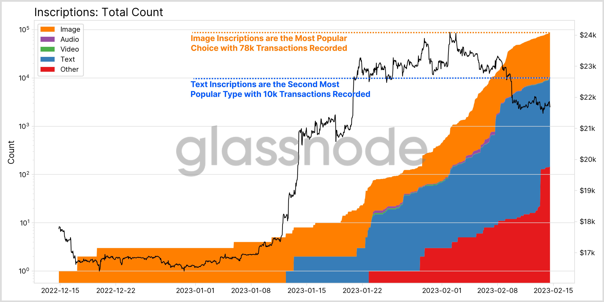

:toc: macro

= RFC 9: Bitcoin Ordinals

:icons: font
:numbered:
toc::[]

== Background

As of 2023-02-23, Bitcoin Ordinals are 🔥 HOT 🔥. Here is a
https://insights.glassnode.com/ordinal-theory-and-the-rise-of-inscriptions/[decent
explainer].



There is not a good way to get those Ordinals over to Ethereum currently, where
Ordinal owners can use the more mature NFT platforms. We could be that way!

Here is an https://ordinals.com/inscription/cfa453dbf693641b8f0c6b83cb733e71832606fc26415c36c70744953d6f6161i0[example ordinal].

=== Current Functionality

Ordinals, at a high level, are single satoshis with metadata stuck into their
witness field (called Inscribing). Each satoshi has an immutable age, which
effectively gives them serial numbers.

These Inscribed Satoshis (called Inscriptions) can be transferred like normal
BTC. The sender's wallet software needs to be careful to not merge the
Inscriptions with "normal" UTXOs, and needs to be careful to not accidentally
send the Inscription as part of a payment. The
https://github.com/casey/ord[casey/ord] repo provides the primatives for the
handling of Ordinals on BTC.

A good mental model here is thinking about Inscriptions like
https://www.apmex.com/product/117942/1932-s-washington-quarter-choice-au[special
edition quarters]. The linked quarter trades for ~$350, but is also legal tender
worth $0.25. An owner of such a quarter probably does not want to use it to pay
for parking. Inscriptions work the same way.

Since Ordinals are still BTC, we can use most of the same tBTCv2 ideas for
custodying Ordinals: rotating wallets, P2SH addresses, fraud proofs,
redemptions, etc, with some slight modifications.

== Proposal

=== Overview

We build a BTC <> Ethereum Ordinal bridge!

We add functionality to the current tBTCv2 client to make future signing groups
compatible with Ordinals. To deposit to these signing groups, we use the same
P2SH process including a refund that we use for tBTCv2. They pay a <<Fees,fee>>.
We optimistically mint using the same Minter & Guardian process we already
havefootnote:[The structure for Minters and Guardians is the same, but the
validation rules would be different]. In the background, we sweep to disable the
refund. Later, someone brings back the NFT and a <<Fees,fee>>. We burn the NFT
and send them their Ordinal.

=== Depositing Details

Depositing works essentially the same way that it does in tBTCv2 with a few key
differences.

Once a deposit is revealed, it is **extremely** important that the wallet does
not sweep them into the same UTXO; that would be destructive. We still need to
sweep to disable the refundfootnote:[Whether or not the sweep can be performed
in a batch is a further research item.]. The sweep needs to preserve the
individual satoshis.

Once custodied, we would mint an ERC721 where the `metadata` field references
the https://docs.ordinals.com/overview.html[Ordinal ID]. They offer multiple
notations; using the Integer Notation looks simple. The reference to the Ordinal
ID is enough for a dApp to pull the underlying content, but it needs to be
plugged in to both Bitcoin and Ethereum.

The ERC721 in the user's Ethereum Wallet points at the Ordinal ID. Then, the
https://github.com/casey/ord[ord] program can identify the associated Ordinal on
BTC, and extract its payload, which looks like:

```
OP_FALSE
OP_IF
  OP_PUSH "ord"
  OP_1
  OP_PUSH "<content-type>" // example: OP_PUSH "text/plain;charset=utf-8"
  OP_0
  OP_PUSH "<content>" // example: OP_PUSH "Hello, world!"
OP_ENDIF
```

=== Redemption Details

Since NFTs are unique, there is no longer choice about which wallet a NFT is
redeemed from. It **must** be the wallet that is the custody of that Ordinal.

The redemption process is otherwise identical to tBTCv2. Someone sends the NFT,
a <<Fees,fee>>, and an ethereum address back to contracts. The associated wallet
sends them their Ordinal to the provided address with a 51-of-100 signature.

=== Fraud Detection

Rather than storing the full list of custodied Ordinals per
walletfootnote:[Storing the full list would of Ordinals be very gas
inefficient.], we instead:

* Take the merkle root of all Ordinals under custody
* Propose this root on chain
* Let anyone challenge this for a reward if it is wrong

This means we are efficiently sure that we have the right merkle root and
underlying custody.

Later, there are two sorts of misbehavior from the custody side:

(1) Sending an Ordinal to an address that did not redeem it and not having it be
  associated with a wallet closure.

(2) Not redeeming an Ordinal within the allotted time.

Anyone can challenge any time (at a cost) for (1). The challenge is defeated by
providing the legimate request within the timeout.

In order to create challenge (2), the challenger must provide a proof that the
Ordinal is being custodied and that a redemption was requested. The challenge is
defeated by providing a SPV proof that the Ordinal was properly transferred.

=== Fees

Taking a percentage cut of an Ordinal does not make sense, so we need to use a
different fee structure.

The simplest structure is to charge flat, governable fees on minting and
redemption. For example, we could charge 0.01 BTC on mint (which we turn into
tBTC and keep as protocol controlled value), and then 0.01 tBTC on redemption
(which we keep as protocol controlled value).

Another option is to charge dynamic redemption fees based on the amount of time
the Ordinal was custodied. Redeeming an Ordinal that has been here for 1 week
might be free, 6 months might cost 0.01 tBTC and 2 years might cost 0.02 tBTC,
for example. This incentivizes folks to redeem earlier, and makes the bridge
attractive for someone who wants to mint -> sell/buy -> exit.

We could also charge more for exiting *quickly*, like how selling stocks in
traditional finance incurs higher tax rates if you do not hold on to them for
long enough. This incentivizes folks to stick around rather than using it for
quick sales.
